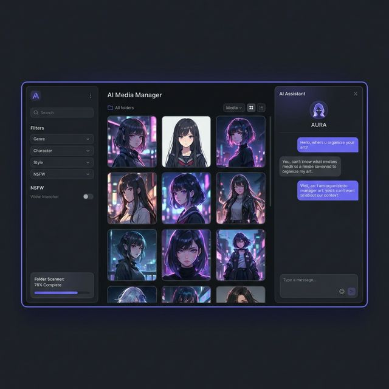
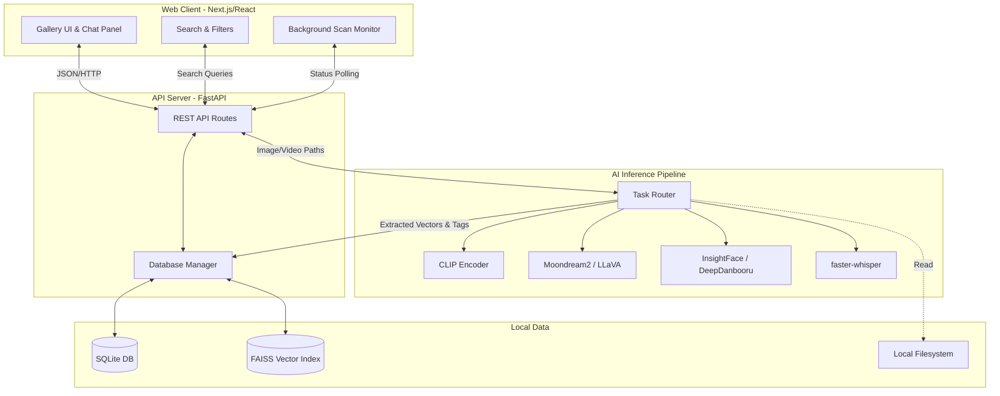
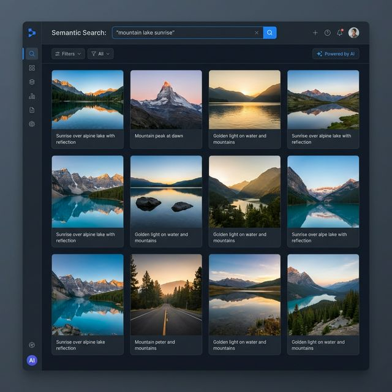

<div align="center">
  
  <h1>Local Curator Prime</h1>
  <p><strong>AI-Powered Local Media Manager & Semantic Search</strong></p>
  <p><em>AI駆動のローカルメディア管理＆セマンティック検索システム</em></p>
</div>

<p align="center">
  
  
  
  
  
</p>

---

## 🌟 Overview / 概要

**Local Curator Prime** is an advanced, offline-first media management tool designed to intelligently categorize, tag, and search through tens of thousands of local images and videos using cutting-edge Vision-Language Models (VLMs) and Semantic Search.

**Local Curator Prime** は、最先端の視覚・言語モデル(VLM)とセマンティック検索を用いて、数万枚以上のローカル画像や動画を自動で分類・タグ付けし、自然言語で検索できるようにする、完全オフライン動作の高度なメディア管理ツールです。

> **Note**: This repository is a portfolio showcase. The core AI models are downloaded locally upon first execution.
> 
> **注意**: このリポジトリはポートフォリオ用の公開モックアップを含みます。コアとなるAIモデルは初回実行時にローカル環境へダウンロードされます。


*(Mockup image of the dashboard interface / ダッシュボードUIのモックアップ画像)*

---

## ✨ Key Features / 主な機能

### 🔍 1. Semantic Search (セマンティック検索)
Instead of matching file names or manual tags, search your local media using natural language descriptions (e.g., *"a girl holding a red umbrella under the rain"*).
ファイル名や手動タグに頼らず、「雨の中で赤い傘を持つ女の子」のような**自然言語の記述で画像・動画を検索**できます（CLIP & FAISS連携）。

### 🤖 2. Automated AI Tagging (自動AIタグ付け)
Automatically extracts characters, series, and general tags from images using specialized models (e.g., DeepDanbooru/WD14), organizing your pristine collection instantly.
専用の画像認識モデルを用いて、画像から**キャラクター名、作品名、一般タグを自動抽出**し、手元の大規模コレクションを瞬時に整理します。

### 🎬 3. Video Understanding (動画・音声理解)
Fully supports video processing. Extracts keyframes for VLM description (Moondream2) and transcribes audio directly using local Whisper to enable deep scene search.
動画処理に完全対応。キーフレームを抽出してVLM(Moondream2)でシーン内容を説明させ、ローカルWhisperで**音声を自動文字起こし**することで、テキストから特定のシーンを瞬時に検索可能です。

### 💬 4. Chat with Media (画像・動画との対話)
Open any image in the gallery and chat directly with it using a Vision-Language Model. Ask about specific details, translate text in the image, or get creative prompts.
ギャラリー内の画像を対象に、視覚言語モデル（VLM）と**直接チャット**が可能。画像内の詳細を尋ねたり、文字を翻訳したりできます。

### ⚡ 5. Offline & Privacy-First (完全オフライン・プライバシー優先)
All heavy AI processing runs locally completely offline. No data is sent to external APIs (OpenAI, etc.), protecting your private collection. 
すべてのAI処理（推論、特徴量抽出）はローカル環境で100%完結。外部のAPIへデータを送信することはなく、安全に管理できます。

---

## 🏗 Architecture / アーキテクチャ構成

The system utilizes a modern web stack backed by a powerful local Python/PyTorch inference engine.
モダンなWebスタックと、強力なローカルPyTorch推論エンジンを組み合わせています。



---

## 🛠 Tech Stack / 技術スタック

### Frontend (User Interface)
- **Next.js 16** (React 19) - App Router
- **Tailwind CSS 4** - Styling & Dark Mode Aesthetics
- **Lucide React** - Iconography

### Backend (Server & API)
- **FastAPI** - High-performance Python web framework
- **Uvicorn** - ASGI server

### AI & Data Engine
- **PyTorch** - Core Deep Learning Framework
- **Transformers / OpenCLIP (Hugging Face)** - CLIP & Text processing
- **FAISS** - Ultra-fast vector similarity search for semantic queries
- **SQLite3** - Relational metadata storage
- **faster-whisper** - Optimized audio transcription
- **InsightFace / Decord** - Face detection & hardware-accelerated video decoding

---

## 🚀 Getting Started / セットアップ手順

### Prerequisites / 前提条件
- **OS**: Windows 10/11, Linux (Ubuntu recommended)
- **Python**: 3.10 or 3.11
- **Node.js**: v18+
- **GPU**: NVIDIA GPU with at least 8GB VRAM (CUDA 11.8+ installed recommended for performance). CPU fallback is supported but extremely slow.
*(VRAM 8GB以上のNVIDIA GPUを強く推奨します。)*

### 1. Backend Setup (バックエンドの起動)

```bash
# Clone the repository
git clone https://github.com/yourusername/local-curator-prime.git
cd local-curator-prime

# Create virtual environment / 仮想環境の作成
python -m venv venv
# Windows: venv\Scripts\activate
# Linux/Mac: source venv/bin/activate

# Install dependencies (ensure PyTorch matches your CUDA version first)
# 依存関係のインストール（先にPyTorchのCUDAバージョンを合わせてください）
pip install torch torchvision torchaudio --index-url https://download.pytorch.org/whl/cu118
pip install -r requirements.txt

# Start the FastAPI server (downloads models on first run - approx. 6GB)
# FastAPIサーバーを起動（初回はモデルのダウンロードが行われます - 約6GB）
cd server
python main.py
```

### 2. Frontend Setup (フロントエンドの起動)

Open a new terminal. / 新しいターミナルを開きます。

```bash
cd local-curator-prime/web

# Install dependencies
npm install

# Start the development server
npm run dev
```

Visit `http://localhost:3000` in your browser.
ブラウザで `http://localhost:3000` にアクセスしてください。

---

## 📸 Screenshots / スクリーンショット

*Screenshots feature mock data for portfolio presentation purposes.*

### Gallery View & Semantic Search

*Search for complex concepts and see exact text match snippets from video audio/frames.*

### Video Analysis & Chat

*Chat directly with the local vision language model about any media file.*

---
*Built with ❤️ for organizing massive digital collections.*

