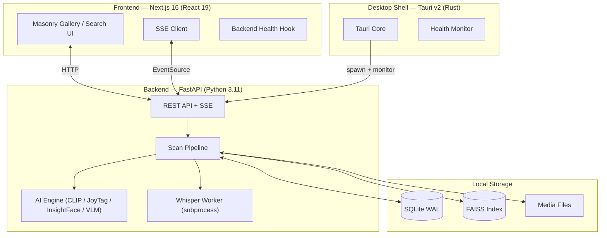

# Local Curator Prime

## AI-Powered Offline Media Manager & Semantic Search


---

## What is Local Curator Prime?

Local Curator Prime is a standalone desktop application that uses AI models to automatically tag, caption, and semantically index local image and video collections. All processing runs entirely on the user's machine — no cloud services, no telemetry, no network egress after initial model download. It combines CLIP embeddings for natural-language search, InsightFace for face recognition, Whisper for speech-to-text, and JoyTag/Florence-2 for illustration tagging and visual captioning.

---

## Features

- **Semantic Search** — Find images by describing them in natural language ([`server/routers/gallery.py`](server/routers/gallery.py))
- **Automated AI Tagging** — CLIP, JoyTag, InsightFace, and VLM-based tag extraction ([`src/core/ai_models.py`](src/core/ai_models.py), [`src/core/joytag_inference.py`](src/core/joytag_inference.py))
- **Video Understanding** — Scene detection, keyframe extraction, and Whisper transcription ([`src/core/video_processor.py`](src/core/video_processor.py), [`src/core/whisper_worker.py`](src/core/whisper_worker.py))
- **Face Recognition** — Detect, name, and search by face across your library ([`src/core/ai_models.py`](src/core/ai_models.py))
- **Reverse Image Search** — Upload an image to find visually similar ones ([`server/routers/dedup.py`](server/routers/dedup.py))
- **Deduplication** — Hash + vector-based duplicate detection and merge ([`src/core/deduplication.py`](src/core/deduplication.py))
- **Smart Albums** — Static and dynamic (auto-updating) albums ([`server/routers/albums.py`](server/routers/albums.py))
- **EXIF/XMP Export** — Write AI-generated metadata back to original files ([`src/core/exporter.py`](src/core/exporter.py))
- **Self-Healing** — FAISS-SQLite integrity auto-repair, sidecar crash recovery ([`src/data/db_manager.py`](src/data/db_manager.py), [`src-tauri/src/main.rs`](src-tauri/src/main.rs))
- **100% Offline** — Zero telemetry, verifiable via built-in privacy audit ([`scripts/privacy_audit.py`](scripts/privacy_audit.py))

---

## Architecture

See **[docs/ARCHITECTURE.md](docs/ARCHITECTURE.md)** for a detailed component breakdown.


```mermaid
graph TD
    subgraph "Desktop Shell — Tauri v2 (Rust)"
        Tauri["Tauri Core"]
        Monitor["Health Monitor"]
    end

    subgraph "Frontend — Next.js 16 (React 19)"
        UI["Masonry Gallery / Search UI"]
        SSE["SSE Client"]
        Health["Backend Health Hook"]
    end

    subgraph "Backend — FastAPI (Python 3.11)"
        API["REST API + SSE"]
        Pipeline["Scan Pipeline"]
        AI["AI Engine (CLIP / JoyTag / InsightFace / VLM)"]
        Whisper["Whisper Worker (subprocess)"]
    end

    subgraph "Local Storage"
        SQLite[("SQLite WAL")]
        FAISS[("FAISS Index")]
        Files["Media Files"]
    end

    UI <-->|HTTP| API
    SSE <-->|EventSource| API
    Tauri -->|spawn + monitor| API
    API --> Pipeline --> AI
    Pipeline --> Whisper
    Pipeline <--> SQLite
    Pipeline <--> FAISS
    Pipeline --> Files
```

---

## Prerequisites

| Dependency  | Version          | Install                                                                            | Notes                                             |
| :---------- | :--------------- | :--------------------------------------------------------------------------------- | :------------------------------------------------ |
| **Python**  | 3.11.x           | [python.org](https://www.python.org/downloads/release/python-3119/)                | **Not** 3.12+ — numpy C extension incompatibility |
| **Node.js** | 20.x LTS         | `winget install OpenJS.NodeJS.LTS` or [nodejs.org](https://nodejs.org/)             | Required for frontend dev server                  |
| **Rust**    | stable (>= 1.84) | `curl --proto '=https' --tlsv1.2 -sSf https://sh.rustup.rs \| sh`                 | Desktop build only                                |
| **CUDA**    | 11.8 (optional)  | [NVIDIA CUDA Toolkit](https://developer.nvidia.com/cuda-11-8-0-download-archive)   | GPU acceleration for AI models                    |

---

## Quick Start (Development)

> **Goal**: Clone → run backend → run frontend → open `http://localhost:3000`. Total setup time: ~15 minutes.

### 1. Clone the repository

```bash
git clone https://github.com/mayonaka-ratori/sortfileslocally.git
cd sortfileslocally/LocalCuratorPrime
```

### 2. Backend

```bash
# Create virtual environment
python -m venv venv

# Activate (Windows PowerShell)
venv\Scripts\Activate.ps1
# Activate (macOS/Linux)
# source venv/bin/activate

# Install dependencies (GPU)
pip install -r requirements.txt

# ---- OR ---- Install dependencies (CPU only, smaller download)
pip install -r requirements-cpu.txt

# Start the API server
python server/main.py
# Output: STARTING_PORT=8000
```

### 3. Frontend

```bash
cd web
npm install
npm run dev
# App opens at http://localhost:3000
```

### 4. Generate TypeScript types (after backend changes)

```powershell
# Windows
./scripts/generate_types.ps1
```

```bash
# macOS/Linux
./scripts/generate_types.sh
```

---

## Quick Start (Desktop Build)

Requires Rust toolchain and all prerequisites above.

**Windows (PowerShell)**:

```powershell
./scripts/build_production.ps1 --cpu-only
```

**macOS / Linux (Bash)**:

```bash
chmod +x scripts/build_production.sh
./scripts/build_production.sh --cpu-only
```

The installer is generated in `src-tauri/target/release/bundle/`.

---

## Project Structure

```text
LocalCuratorPrime/
├── server/                   # FastAPI app
│   ├── main.py               #   App factory, CORS, router registration
│   ├── dependencies.py       #   Dependency injection (DB, AI engine)
│   ├── state.py              #   In-memory scan status
│   └── routers/              #   Route modules (gallery, media, scan, albums, dedup, scenes, setup, demo, privacy, insights)
├── src/                      # Shared Python logic
│   ├── config.py             #   Global configuration constants
│   ├── core/                 #   AI models, processing pipeline, video analysis
│   │   ├── ai_models.py      #     CLIP, InsightFace, Whisper orchestration
│   │   ├── processor.py      #     Main scan pipeline (single + batch)
│   │   ├── video_processor.py#     Scene detection, keyframe extraction
│   │   ├── whisper_worker.py #     Persistent subprocess for transcription
│   │   ├── joytag_inference.py#    JoyTag illustration tagging
│   │   ├── vlm_engine.py     #     Florence-2 captioning
│   │   ├── model_manager.py  #     Model download/status registry
│   │   ├── deduplication.py  #     Hash + vector dedup engine
│   │   ├── exporter.py       #     EXIF/XMP write-back
│   │   └── ...               #     classifier, hashing, intelligence, scanner, etc.
│   └── data/                 #   Data layer
│       ├── db_manager.py     #     SQLite + FAISS manager (89K lines)
│       ├── schemas.py        #     Core dataclasses (MediaItem, VectorData, FaceData, etc.)
│       └── scan_job_manager.py#    Persistent scan job tracking
├── web/                      # Next.js 16 frontend
│   ├── src/lib/api.ts        #   API client (all backend calls)
│   ├── src/lib/api-types-bridge.ts # Generated type bridge
│   ├── src/hooks/            #   React hooks (useBackendHealth, useScanProgress, useKeyboardShortcuts)
│   ├── src/generated/        #   Auto-generated OpenAPI types
│   └── src/messages/         #   i18n locale files (en.json, ja.json)
├── src-tauri/                # Tauri v2 desktop shell
│   ├── src/main.rs           #   Sidecar lifecycle, health monitor, IPC commands
│   └── tauri.conf.json       #   App config, bundle settings, updater
├── tests/                    # Python test suite (40 files)
├── scripts/                  # Build & admin utilities
├── docs/                     # Extended documentation
├── .github/workflows/ci.yml  # CI pipeline (4 jobs)
├── pyproject.toml            # pytest configuration
├── requirements.txt          # GPU dependencies
├── requirements-cpu.txt      # CPU-only dependencies
└── localcurator-backend.spec # PyInstaller spec file
```

---

## Testing

### Python Backend

```bash
# Full test suite (skips GPU and slow tests)
python -m pytest tests/ -v -m "not gpu and not ai_models and not slow"

# With GPU tests (requires CUDA + model weights)
python -m pytest tests/ -v

# CORS-only tests
python -m pytest tests/test_cors.py -v

# SQLite stress test (100 concurrent writers)
python -m pytest tests/test_sqlite_stress.py -v

# Inference accuracy tests (requires real models)
python -m pytest tests/test_inference_accuracy.py -v -m ai_models

# Performance benchmark
python scripts/benchmark_scan.py
```

### Frontend

```bash
cd web

# TypeScript type check
npx tsc --noEmit

# ESLint
npm run lint

# i18n completeness check
python scripts/check_i18n_completeness.py
```

### Rust

```bash
cd src-tauri
cargo check
```

---

## API Endpoints

| Method   | Path                           | Description                               | Response Model                |
| :------- | :----------------------------- | :---------------------------------------- | :---------------------------- |
| `GET`    | `/health`                      | Health check                              | `{"status": "ok"}`            |
| `GET`    | `/gallery/media`               | List media with filters                   | `List[MediaItemResponse]`     |
| `POST`   | `/gallery/search`              | Hybrid semantic + SQL search              | `HybridSearchResponse`        |
| `GET`    | `/gallery/search/history`      | Recent search history                     | `List[SearchHistoryResponse]` |
| `GET`    | `/gallery/filters`             | Available filter values                   | `FiltersResponse`             |
| `POST`   | `/gallery/chat`                | VLM question answering                    | `ChatResponse`                |
| `GET`    | `/gallery/{id}/faces`          | Detected faces for a file                 | `List[FaceResponse]`          |
| `GET`    | `/gallery/faces/{id}/search`   | Search by face                            | `List[MediaItemResponse]`     |
| `GET`    | `/gallery/tags/suggest`        | Tag autocomplete                          | `List[TagSuggestion]`         |
| `GET`    | `/gallery/tags/stats`          | Tag usage statistics                      | `TagStatsResponse`            |
| `GET`    | `/media/{id}/original`         | Serve original file                       | File stream                   |
| `GET`    | `/media/{id}/thumbnail`        | Serve resized thumbnail                   | JPEG stream                   |
| `POST`   | `/media/{id}/tags`             | Add tags                                  | `TagUpdateResponse`           |
| `DELETE` | `/media/{id}/tags`             | Remove tags                               | `TagUpdateResponse`           |
| `POST`   | `/media/tags/bulk`             | Bulk tag operations                       | `BulkTagResponse`             |
| `POST`   | `/media/{id}/rescan`           | AI re-process a file                      | `JobStartResponse`            |
| `POST`   | `/media/export`                | Export metadata (XMP/EXIF)                | `ExportResultResponse`        |
| `POST`   | `/scan/start`                  | Start directory scan                      | `ScanStartResponse`           |
| `POST`   | `/scan/resume`                 | Resume interrupted scan                   | `ScanStartResponse`           |
| `GET`    | `/scan/status/stream/{job_id}` | SSE scan progress stream                  | `text/event-stream`           |
| `GET`    | `/scan/jobs`                   | List recent scan jobs                     | `List[ScanJobResponse]`       |
| `GET`    | `/albums/`                     | List albums                               | `List[AlbumResponse]`         |
| `POST`   | `/albums/`                     | Create album                              | `int`                         |
| `GET`    | `/albums/{id}/media`           | Get album media                           | `List[MediaItemResponse]`     |
| `POST`   | `/dedup/find`                  | Find duplicate candidates                 | `List[DuplicatePairResponse]` |
| `POST`   | `/dedup/apply`                 | Apply dedup (delete files)                | `DeleteResultResponse`        |
| `POST`   | `/dedup/reverse-search`        | Reverse image search (upload)             | `List[ReverseSearchResponse]` |
| `POST`   | `/scenes/{id}/detect`          | Trigger scene detection                   | `JobStartResponse`            |
| `GET`    | `/scenes/search`               | Scene semantic search                     | `List[SceneSearchResponse]`   |
| `GET`    | `/setup/models`                | AI model statuses                         | `List[ModelStatusResponse]`   |
| `POST`   | `/setup/models/download`       | Download a model                          | `DownloadStartResponse`       |
| `GET`    | `/setup/settings`              | Application settings                      | `AppSettingsResponse`         |
| `POST`   | `/setup/settings`              | Update a setting                          | `SettingUpdateResponse`       |
| `GET`    | `/insights`                    | Library analysis suggestions              | `InsightsResponse`            |
| `GET`    | `/privacy/audit`               | Run static privacy audit                  | JSON report                   |
| `GET`    | `/demo/status`                 | Demo mode status                          | `DemoStatusResponse`          |

Full OpenAPI specification: **[docs/api.md](docs/api.md)** or `http://localhost:8000/docs` (Swagger UI).

---

## Configuration

### Environment Variables

| Variable               | Default  | Description                              |
| :--------------------- | :------- | :--------------------------------------- |
| `CORS_ORIGINS`         | (empty)  | Comma-separated additional CORS origins  |
| `CUDA_VISIBLE_DEVICES` | (all)    | Restrict GPU devices for PyTorch         |

### Files

| File                        | Purpose                                                       |
| :-------------------------- | :------------------------------------------------------------ |
| `pyproject.toml`            | pytest markers (`gpu`, `ai_models`, `slow`, `e2e`) and paths  |
| `src-tauri/tauri.conf.json` | Window size, CSP, updater endpoint, sidecar path              |
| `web/next.config.mjs`       | Static export, image optimization settings                    |

---

## CI/CD

The GitHub Actions pipeline (`.github/workflows/ci.yml`) runs on every push/PR to `main` and contains four jobs:

| Job               | Runner        | What it validates                                           | Timeout |
| :---------------- | :------------ | :---------------------------------------------------------- | :------ |
| `backend-test`    | ubuntu-latest | `pytest` (excluding `gpu`, `ai_models`, `slow` markers)     | 15 min  |
| `frontend-check`  | ubuntu-latest | `tsc --noEmit` + `npm run lint`                             | 15 min  |
| `i18n-check`      | ubuntu-latest | `python scripts/check_i18n_completeness.py`                 | 5 min   |
| `rust-check`      | ubuntu-latest | `cargo check` (with GTK dev dependencies)                   | 20 min  |
| `type-gen-verify` | ubuntu-latest | Regenerate OpenAPI types and diff against committed version | 10 min  |

---

## Scripts Reference

| Script                               | Purpose                                    | Usage                                       |
| :----------------------------------- | :----------------------------------------- | :------------------------------------------ |
| `scripts/build_production.ps1`       | Windows production build orchestrator      | `./scripts/build_production.ps1 --cpu-only` |
| `scripts/build_production.sh`        | macOS/Linux production build orchestrator  | `./scripts/build_production.sh --cpu-only`  |
| `scripts/build_backend.py`           | PyInstaller backend compilation            | `python scripts/build_backend.py`           |
| `scripts/build_desktop.py`           | Tauri desktop bundle                       | `python scripts/build_desktop.py`           |
| `scripts/generate_types.ps1`         | OpenAPI → TypeScript type generation (Win) | `./scripts/generate_types.ps1`              |
| `scripts/generate_types.sh`          | OpenAPI → TypeScript type generation (Uni) | `./scripts/generate_types.sh`               |
| `scripts/benchmark_scan.py`          | Scan pipeline performance benchmark        | `python scripts/benchmark_scan.py`          |
| `scripts/check_i18n_completeness.py` | Verify en/ja locale file parity            | `python scripts/check_i18n_completeness.py` |
| `scripts/privacy_audit.py`           | Static analysis for external network calls | `python scripts/privacy_audit.py`           |

---

## Contributing

1. **Branch naming**: `feat/short-description`, `fix/short-description`, `docs/short-description`.
2. **Commits**: Use [Conventional Commits](https://www.conventionalcommits.org/) (`feat:`, `fix:`, `docs:`, `chore:`, `test:`, `ci:`).
3. **PR checklist**:
   - [ ] All CI checks pass (`backend-test`, `frontend-check`, `i18n-check`, `rust-check`, `type-gen-verify`)
   - [ ] New features include tests
   - [ ] TypeScript types regenerated if API changed
   - [ ] Code comments in English
   - [ ] No `any` types in TypeScript

---

## Known Issues

See **[ROADMAP.md](ROADMAP.md#known-issues--tech-debt)** for the full issue tracker with severity, workarounds, and resolution status.

---

## Documentation Index

| Document                                                                    | Description                                            |
| :-------------------------------------------------------------------------- | :----------------------------------------------------- |
| [ROADMAP.md](ROADMAP.md)                                                    | Sprint history, release blockers, future roadmap, ADRs |
| [docs/REQUIREMENTS.md](docs/REQUIREMENTS.md)                                | IEEE 830-style functional/non-functional spec          |
| [docs/ARCHITECTURE.md](docs/ARCHITECTURE.md)                                | System architecture with mermaid diagram               |
| [docs/api.md](docs/api.md)                                                  | API endpoint documentation                             |
| [docs/i18n.md](docs/i18n.md)                                                | Internationalization guide                             |
| [docs/USER_MANUAL_EN.md](docs/USER_MANUAL_EN.md)                            | English user manual                                    |
| [docs/USER_MANUAL_JP.md](docs/USER_MANUAL_JP.md)                            | Japanese user manual                                   |
| [docs/dependency-audit-2026-03-04.md](docs/dependency-audit-2026-03-04.md) | Security audit findings                                |
| [CHANGELOG.md](CHANGELOG.md)                                                | Sprint 1-6 changelog                                   |
| [PACKAGING_STRATEGY.md](PACKAGING_STRATEGY.md)                              | Tauri + PyInstaller analysis                           |

---

## License

MIT License — see the [LICENSE](LICENSE) file for details.
