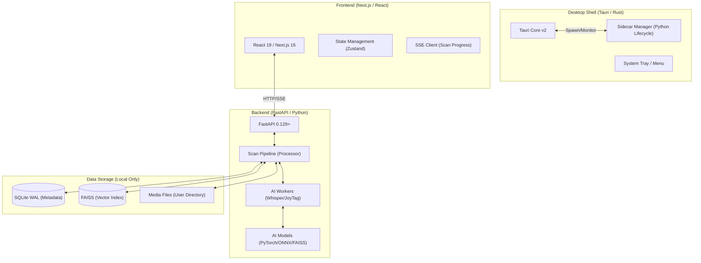

# System Architecture - LocalCurator Prime

LocalCurator Prime is a local-first, AI-powered media management application. It follows a hybrid architecture combining a high-performance Rust shell, a modern React frontend, and a specialized Python backend for AI inference.

## 1. High-Level Architecture

## 2. Component breakdown

### 2.1 Backend Sidecar (FastAPI)

The backend is a compiled Python executable (via PyInstaller) that runs as a Tauri sidecar. It exposes a REST API for the frontend and handles:

- **File Discovery & Hashing**: CRC/BLAKE3 hashing of media files.
- **AI Inference**: CLIP (multimodal embedding), JoyTag (illustration tagging), InsightFace (face grouping), Whisper (speech-to-text), and Scene Detection.
- **Vector Search**: Using FAISS for sub-millisecond similarity search across potentially millions of items.

### 2.2 Frontend (Next.js)

A statically exported Next.js application that provides:

- **Responsive Gallery**: Smooth rendering of thousands of thumbnails.
- **Natural Language Search**: Semantic queries converted to vectors via the backend.
- **Real-time Feedback**: SSE-based scan progress and backend health monitoring.

### 2.3 Desktop Shell (Rust)

The Tauri core manages the application lifecycle:

- **Sidecar Health**: Automatically restarts the Python backend if it crashes.
- **System Integration**: Native file dialogs, system tray, and local file protocol.
- **Security**: Strict CSP and network logging to ensure zero data leakage.

## 3. Data Flow

1. **Scan**: User selects a folder -> Scanner discovers files -> Pipeline calculates hashes -> AI models extract vectors/tags -> Data is written to SQLite and FAISS.
2. **Search**: User types "sunset on the beach" -> CLIP converts text to vector -> FAISS finds nearest neighbors -> SQLite joins metadata -> Results shown in Gallery.
3. **Recovery**: Sidecar monitor detects a crash -> Tauri emits event -> Backend restarts on a fresh port -> Metadata/Indices are auto-repaired on boot.

## 4. Technology Stack

- **UI**: Next.js 16.1.6, React 19, Tailwind 4, Framer Motion.
- **API**: FastAPI, Pydantic v2, Uvicorn.
- **AI**: PyTorch 2.5.1, Transformers, Faster-Whisper, Faiss-CPU, InsightFace.
- **Desktop**: Tauri 2.0 (Rust 1.93.1), PyInstaller.
