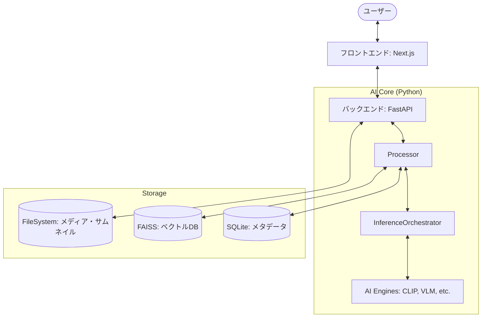

# 技術仕様書 (TECHNICAL_SPEC.md)

## 1. システムアーキテクチャ
LocalCuratorPrimeは、高機能なAI解析処理の実行と、快適なユーザーインターフェースを両立させるため、以下のコンポーネント構成を採用しています。



## 2. 開発スタック (Versions)
- **Frontend**: Next.js 16.1.6 (React 19.2.3), Tailwind CSS 4, Lucide React
- **Backend**: FastAPI 0.129.0, Uvicorn 0.41.0, Python 3.10+
- **AI/ML**: PyTorch 2.5.1, Transformers 4.39.3, FAISS 1.13.2, faster-whisper 1.2.1, InsightFace 0.7.3
- **Data**: SQLite3, Pandas, Pillow, decord (動画読込)

## 3. ディレクトリ構造
```text
LocalCuratorPrime/
├── server/            # APIサーバー
│   ├── routers/       # エンドポイント定義 (scan, gallery, media, dedup, setup)
│   ├── dependencies.py# 依存関係注入 (Singletonインスタンス管理)
│   └── main.py        # サーバー起動エントリーポイント
├── web/               # Next.js SPA
│   ├── src/components # UIコンポーネント (GalleryGrid, ChatPanel等)
│   └── src/hooks      # API通信ロジック (useSearch, useScan)
├── src/               # コアロジック (共有)
│   ├── core/          # 推論・解析ロジック (Inference, VideoProcessor, Exporter等)
│   └── data/          # 永続化層 (DBManager, Schemas, ScanJobManager)
└── data/ (Git外)      # データベース、インデックス、キャッシュ
```

## 4. データベース・スキーマ
### 4.1 SQLite (metadata.db)
- **`files` テーブル**: メディアの基本属性とAI解析結果の文字データを保持。
  - `id`: INTEGER (PK)
  - `file_path`: TEXT (UNIQUE)
  - `file_hash`: TEXT (変更検知用)
  - `media_type`: TEXT ('image' or 'video')
  - `tags`, `character_tags`, `series_tags`: TEXT (JSON化された文字列リスト)
  - `caption`: TEXT (VLMによる長文説明)
  - `audio_transcription`: TEXT (JSON: 動画の音声文字起こし)
  - `frame_descriptions`: TEXT (JSON: 動画のシーン説明)
- **`faces` テーブル**: 検出された顔のメタデータ。
  - `file_id`: INTEGER (FK)
  - `bbox`: TEXT (JSON: 四角形座標)
  - `timestamp`: REAL (動画内の出現秒数)
- **`scan_jobs` / `scan_errors`**: スキャンの進捗管理およびエラーログ。

### 4.2 FAISS Indices
- **`vectors.index`**: CLIPによる画像/動画の全体特徴量 (768次元, IndexIDMap2 + IndexFlatIP)。
- **`faces.index`**: InsightFaceによる顔特徴量 (512次元, IndexIDMap2 + IndexFlatIP)。

## 5. API エンドポイントリファレンス

### 5.1 主要エンドポイント JSON スキーマ

#### **POST /scan/start** (スキャン開始)
- **Request Body**:
```json
{
  "target_path": "string (絶対パス)",
  "force_reprocess": "boolean (任意, デフォルト: false)",
  "exclude_dirs": ["string (任意)"]
}
```
- **Response (200 OK)**:
```json
{
  "job_id": "integer",
  "status": "string (pending|running)",
  "target_path": "string"
}
```

#### **POST /gallery/search** (セマンティック検索)
- **Query Parameters**: `query` (string), `top_k` (integer)
- **Response (200 OK)**:
```json
[
  {
    "id": "integer",
    "file_path": "string",
    "media_type": "string",
    "width": "integer|null",
    "height": "integer|null",
    "tags": ["string"],
    "character_tags": ["string"],
    "series_tags": ["string"],
    "caption": "string|null",
    "score": "float (類似度スコア)",
    "snippet": "string|null (検索ヒット箇所)"
  }
]
```

#### **POST /media/export-metadata** (メタデータ書き出し)
- **Request Body**:
```json
{
  "file_ids": ["integer"],
  "mode": "string (xmp|exif)"
}
```
- **Response (200 OK)**:
```json
{
  "success_count": "integer",
  "failed_count": "integer",
  "errors": [{"file_id": "integer", "error": "string"}]
}
```

#### **POST /dedup/candidates** (重複候補抽出)
- **Request Body**:
```json
{
  "threshold_img": "float (0.0-1.0, デフォルト: 0.95)",
  "threshold_vid": "float (0.0-1.0, デフォルト: 0.98)"
}
```
- **Response (200 OK)**:
```json
[
  {
    "file_a": {"file_path": "string", "file_size": "integer", "media_type": "string"},
    "file_b": {"file_path": "string", "file_size": "integer", "media_type": "string"},
    "similarity": "float",
    "recommended_action": "string",
    "reason": "string"
  }
]
```

#### **GET /setup/models** (モデル情報の取得)
- **Response (200 OK)**:
```json
[
  {
    "key": "string",
    "name": "string",
    "source": "string",
    "repo_id": "string",
    "is_downloaded": "boolean",
    "local_size_mb": "float",
    "estimated_size_mb": "integer",
    "local_dir": "string"
  }
]
```

#### **POST /setup/settings** (設定の更新)
- **Request Body**:
```json
{
  "key": "string (例: 'custom_model_dir')",
  "value": "string"
}
```
- **Response (200 OK)**:
```json
{
  "status": "string",
  "key": "string",
  "value": "string",
  "requires_restart": "boolean (特定のキーが変更された場合に true になります)"
}
```

## 6. AI/ML パイプライン
解析は以下のモデルをパイプラインとして実行します。

| モデル名 | 役割 | 入力形式 | 出力形式 / 次元 |
|:---|:---|:---|:---|
| **CLIP (ViT-L-14)** | セマンティック特徴量 / スタイル判定 | `PIL.Image` (224x224) または `str` | `float32[768]` (Normalized Embedding) |
| **InsightFace (buffalo_l)** | 顔検出・識別 | `numpy.ndarray` (BGR) | `float32[512]` (Face Embedding + BBox) |
| **JoyTag (JoyTag-v1)** | キャラクター、作品、属性タグ | `PIL.Image` (448x448) | `List[str]` (多階層タグ) |
| **Florence-2** | セマンティックキャプション / VQA | `PIL.Image` + `str` (Prompt) | `str` (Natural Language Description) |
| **faster-whisper (base)** | 動画音声の文字起こし | `audio_path` (16kHz Mono WAV) | `List[Dict]` (text, start, end) |

## 7. 特徴的機能と制限

### 7.1 中断・再開 (Scan Resume)
- **ScanJobManager** により、スキャン進捗は SQLite に永続化されます。
- 万が一サーバーが停止した場合や、ユーザーが明示的に中断した場合でも、前回最後に処理に成功したファイルパスから解析を再開することが可能です。
- これは `last_processed_path` カラムに基づき、ディレクトリ走査をスキップすることで実現されています。

### 7.2 VRAM管理
- 高負荷なVLMモデルは、必要なタイミングでのみロードされ、アイドル時間が続くと自動的にVRAMから解放される仕組みを備えています。

## 8. 環境変数 & 設定 (settings.local.json)
システムの設定は `src/config.py` およびルート直下の `settings.local.json`（存在する場合）によって制御されます。

### 8.1 設定項目
- **`DB_DIR`**: データベースおよびインデックスを保存する場所 (デフォルト: `data/db`)。
- **`DEFAULT_INPUT_DIR`**: スキャン対象の初期ディレクトリ。
- **`ALLOWED_EXTENSIONS`**: 処理対象とする拡張子のリスト。
- **`VRAM_LIMIT_GB`**: AIモデルのロードを制限するためのVRAM閾値。

### 8.2 JSON 設定例 (`settings.local.json`)
```json
{
  "DB_DIR": "C:/LocalCuratorData/db",
  "DEFAULT_INPUT_DIR": "D:/MyPhotos",
  "JOYTAG_THRESHOLD": 0.4,
  "DEVICE": "cuda"
}
```
> [!NOTE]
> `settings.local.json` が存在しない場合は、`src/config.py` 内のデフォルト値が使用されます。
